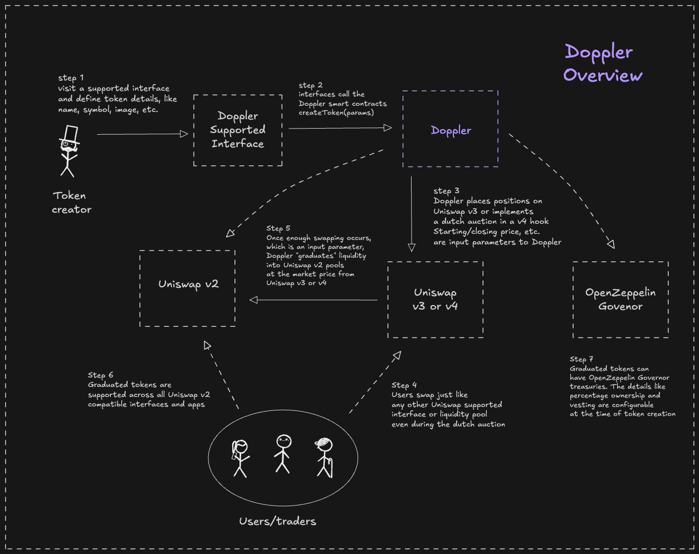

# Explainer



#### Tokens get created

Any application can permissonlessly create tokens from the Doppler smart contracts. These tokens can be memecoins, RWAs, governance tokens — whatever your app focuses on.



#### Creation

Tokens get created by calling the Doppler smart contracts with customized inputs.



#### Price discovery

Tokens go through a price discovery period, fully onchain. Doppler v3 uses a static bonding curve while Doppler v4 uses a dynamic bonding curve, based on a dutch auction.



#### Migration

Once the parameterized amount of tokens have been purchased or swapped, the tokens and LP positions automatically get migrated to Uniswap (v2, to grow liquidity overtime through fees), bootstrapping their initial liquidity and triggering other contract interactions.



#### Treasury

Tokens can be created with OpenZeppelin Governor Treasuries to give communities a canonical home for their ecosystem where they can propose and vote on actions as a collective.



#### Complete :tada:

This newly created token is freely swappable across all Uniswap supported interfaces and able to be utilized throughout your favorite applications, DeFi protocols, and interfaces.



<figure><figcaption>
Doppler Overview
</figcaption></figure>

### Design principles

* **Capital efficiency**
  * Uniswap and Doppler are highly optimized to help tokens find their fair market price.
* **MEV protecting**
  * Users are protected from sniping bots compared to other platforms due to the novel dynamics of the dutch auction based bonding curve, disrupting the dynamics of apeing in early.
* **Programmability**
  * Doppler's smart contracts are fully onchain and composable with other programs.
  * We envision a large ecosystem and variety of mechanisms for token distribution & management, such as: vesting, airdrops, incentives, dao management, and more.
* **EVM & DeFI native**
  * Automatically integrate your tokens into the latest & greatest Ethereum based DeFi protocols.
* **Uniswap compatibility**
  * Tokens created on Doppler that reach their specific goals of liquidity will automatically get migrated to their own Uniswap v2 or Uniswap v4 pools and swappable from Uniswap supported interfaces. Eventually other AMMs may be supported.

See the [Doppler Roadmap](../resources/protocol-roadmap.md) for insights as to what might be coming next.

